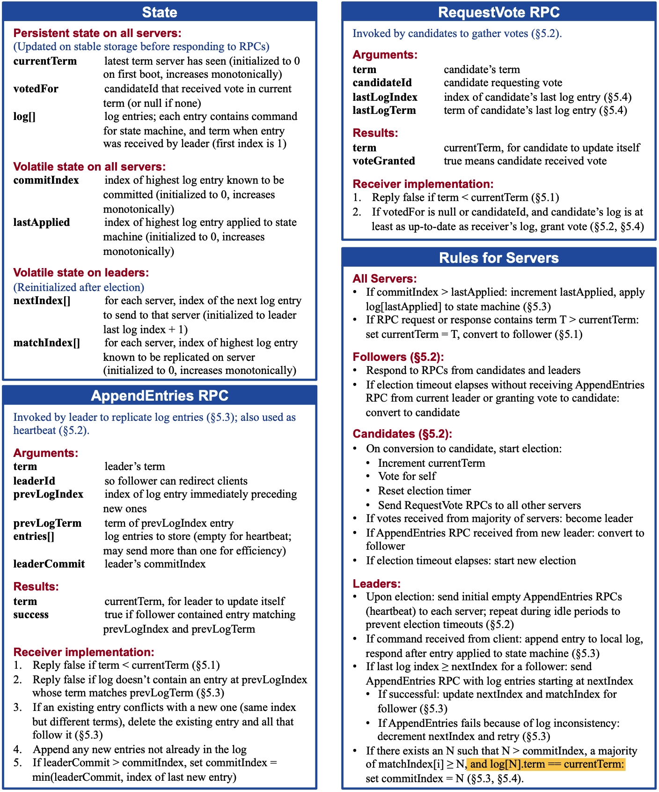

# MIT6.824

## Lab1

MapReduce。首先初始化很多MapTasks，放入taskChan,循环判断taskChan中的数据状态是否完成，没有完成则再放入一个同样的新任务，直到所有的Map任务完成，则再放入Task任务。中间文件是mr-temp-%d-%d.temp的形式，map将自己的文件所有word count都统计好，再根据hash将对应的word分配到对应的reduce中。Reduce会将hash（key）相同的word统计好合并到自己的输出文件中。

## Lab2

Raft介绍：

Raft的Term是逻辑时间，用来解决分布式时间不准导致的时序问题。**Term必须持久化，否者如果Leader还有其他的follower依次宕机，新来后currentTerm都是0，但是日志的Term更高，安全性无法满足**

VoteFor表示当前任期的时候投给了谁（只投给第一个满足条件的candidate），**VoteFor必须持久化，否者重启后可能会投给其他人。导致出现两个leader**

**lastApplied需要持久化**，因为如果是磁盘中的状态机，重启后apply日志，需要知道之前apply到哪里了

**log需要持久化**，如果log遗失掉，则之前已经提交到多数派的log就不安全了，可能出现新的leader覆盖掉其他人的log。

Raft 有2个定时器，定期执行以下两个线程

* TryElection 调用RequestVote，出现选举超时（T-2T之间，比如150ms-300ms）的时候

如果收到了更大任期的请求，就更新term，转为follower

再比较日志，如果对方日志更完整则投票同意

* TryHeartBeat 调用AppendEntries，Leader发起，给其他节点发送心跳

**处理节点的请求** 也是两个函数RequestVote和AppendEntries，用来处理tryxxx的RPC请求。

**处理命令** 当Leader 收到command存储到日志当中，在下一次的AppendEntries中发送给Follower，Follower会根据leaderCommit调用`tryCommitIndex`。Leader也会根据日志的同步情况也更新leaderCommit。`tryCommitIndex`会将command放入applyCh中等待其他线程处理。

**安全性保证**：

1. 如果两个节点的日志在相同Index的位置上Term也想相同，则认为他们日志的命令也相同
2. 如果提交一个记录，则这个记录之前的记录也已提交。

注意点：Leader**不能提交之前任期的条目**，除非其中含有一条自己的日志。

原因：即使把之前任期的日志复制到大多数节点，但因为之前日志的任期低，安全性无法得到保证。还可能另外一个Leader，拥有Index相同但任期更高的日志，覆盖了这个旧的日志，导致一个Index的日志提交了两次。

解决方法是：**no-op日志**，来延迟提交之前任期的日志

**客户端协议** ：对每个请求都加上对应的clientId和requestId，来防止处理重复的请求，保证只执行一次，这是实现线性一致性的关键。

**线性一致性**的实现：

* 读请求与写请求一起处理，进行持久化
* **Leader用readIndex**提高读性能（网络轮次较多）
  1. Leader写入no-op之后，就可以将commitIndex赋值给readIndex。如果收到读请求，就会给其他follower发送心跳，确认自己是leader，如果收到了多数派的心跳，就说明从他发送心跳的那一刻，系统不存在一个任期更大的leader了。此时readIndex(即commitIndex)就是当前系统最大的已提交的索引。
  2. 等到apply到commitIndex，就是可以执行读请求，将结果返回给client。
* **follower用readIndex**来提供读性能。所以follower也需要向leader获取最新的readIndex。leader则会再次执行之前的操作，向其他的节点发送心跳，判断当前的readIndex有效。follower来执行第二步，处理读请求
* 维护一个**心跳租约**，当leader的心跳被多数派确认，在start + electionTimeout / clockDriftBound 时间内，可以安全的处理只读查询。因为raft保证在electionTimeout时间内不会选出一个新leader。除非出现了时间漂移，比如时钟同步。

配置变更：TODO

配置变更可能导致整个集群不可用，需要**Pre-Vote**（pre-vote请求的时候不会增加自己的任期）

一个节点同意Pre-Vote请求的条件是：

* 参数中任期更大，或者任期相同但是日志索引更大
* 至少一次选举超时时间内没有收到领导者心跳（系统不应该扰乱一个活跃的领导者）

Pre-Vote可以解决配置变更干扰leader的问题，还可以解决网络分区时脑裂的问题和任期爆炸增长的问题。为了提高可用性，还有Learner的设计，新加入的节点状态是**Learner**，Learner加入集群不参与投票，直到追赶上领导者。

**极端场景下**的活性问题：

如果一个节点不能收到其他节点的消息，但是可以给其他节点发送消息：

他会不停的发起选举扰乱整个集群，**Pre-Vote**可以解决这个问题。

但是如果一个场景下123可以互相通讯，2和4可以互相通讯，4之前是leader，5宕机了。13想要发起选举，但是2知道leader是活着的，不会同意，所以导致整个集群无法选出新的leader，旧Leader的日志又无法覆盖全部节点。虽然5个节点3个是满足多数派条件，但整个集群依然不可用。所以Pre-Vote启到了反作用。

需要增加leader**主动下台**的机制。如果leader没有收到超过半数节点的appendEntry响应就主动下台。etcd称这个是checkQuorum机制，Pre-Vote + CheckQuorum就可以解决Raft算法的活性问题了。

Raft性能优化：pipeline流水线和batch批处理（一次处理多个client的请求）

## Lab3

KvRaft，接受get或者put请求，请求包括clientID和requestID用来判断请求是否重复（里面有2个map，一个存储一个clientid对应的最小requestid，另一个对应index的notify）。然后调用rf.start，让raft同步请求，raft同步并commit成功后会发送到applyCh中，kvraft的协程之一会一直等待applyCh，收到请求后就根据日志对db进行更新并放到对应日志index的ch中，请求端则取出ch中的数据判断是否成功

## Lab4A

ShardMaster，处理客户端发送的请求，如果的query则同步后返回配置，如果是leave，join，move则更新config，架构类似LAB3

## Lab4B 

Config类型包括config number，shared->gid，gid->servers[]。每次配置更变都会重新分配每个gid对应的shared

sendShardQueue : config number -> shard -> db

waitShardQueue: shard -> config number

serverShards： shard -> bool（对应的shard是否提供服务）

garbages : config number -> shard -> bool（）

ShardKV，主要分为3个定时请求

1. `updateConfigAndQueue`定期从ShardMaster获取最新的配置，如果是新配置，则根据配置准备好需要给其他group的数据sendShardQueue并且标记好需要的数据waitShardQueue。
2. `updateDB`第二个定时请求则根据标记waitShardQueue定期从其他group获取数据更新的db和lastrequest，同时维护garbagelist表明对方的sendShardQueue中维护的数据可以删除了。
3. 第三个是垃圾回收请求，根据第二个请求维护的garbageList来一个一个发送`tryGarbageCollection`请求，通知其他集群清理sendShardQueue中的数据。

 