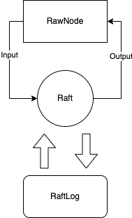

## 架构



### Raft

为上层提供Tick()，Step()服务。Tick()驱动内部定时器运行，Step()处理外部传来的消息

消息类型：


### RawNode

封装了Raft，主要调用`Step`驱动Raft，并且将Raft的结果以`Ready`反馈给上层

`HasReady()`：判断Raft状态是否发生变化，其中HardState需要持久化，SoftState不需要持久化

* HardState：Term、Vote、Commit
* SoftState：Leader、RaftState(身份)
* Snapshot
* msgs（与其他raft交流的信息）
* CommitedEntries（需要commit）
* Entries（需要持久化）

`Ready()`，将上述数据包装成Ready结构。


### RaftLog

包括raftlog内存部分和peer_storage磁盘部分。


### RaftStore


RaftStore 会在节点启动的时候被创建，它负责维护在该节点上所有的 region 和对应的 peer。

RaftStore 使用 `storeMeta `维护该节点所有的元数据。

```
type storeMeta struct {
  sync.RWMutex
  /// region end key -> region ID
  regionRanges *btree.BTree
  /// region_id -> region
  regions map[uint64]*metapb.Region
  /// `MsgRequestVote` messages from newly split Regions shouldn't be dropped if there is no
  /// such Region in this store now. So the messages are recorded temporarily and will be handled later.
  pendingVotes []*rspb.RaftMessage
}
```

- `sync.RWMutex` ，因为一个 RaftStore 上面的多个 region 可以同时接收请求，所以为了防止它们同时修改 storeMeta 元数据，这里会提供一个锁。
- `regionRanges`，用于快速定位某一个 key 在哪个 region 中。
- `regions`，region id 映射 region 结构体。
- `pendingVotes`，自己不用管，已经写好了。


具体执行请求，raft_worker.go中的run会将msg分类，然后nwePeerMsgHandler，首先处理msg，然处理peer的ready状态。PeerMsgHandler用完即扔


RaftLog，Raft 和 RawNode 的处理流程。

- 上层会出发 RawNode 的 `tick()` 函数发，RawNode 触发 Raft 的 `tick()` 函数。
- 上层会定时从 `RawNode` 获取 Ready，首先上层通过 `HasReady()` 进行判断，如果有新的 Ready，上层会调用 RawNode 的 `Ready()`方法进行获取，RawNode 从 Raft 中 获取信息生成相应的 Ready 返回给上层应用，Raft 的信息则是存储在 RaftLog 之中。上层应用处理完 Ready 后，会调用 RawNode 的 `Advance()` 方法进行推进，告诉 RawNode 之前的 Ready 已经被处理完成，然后你可以执行一些操作，比如修改 applied，stabled 等信息。
- 上层应用可以直接调用 RawNode 提供的 `Propose(data []byte)` ，`Step(m pb.Message)` 等方法，RawNode 会将这些请求统一包装成 Message，通过 Raft 提供的 `Step(m pb.Message)` 输入信息。
- 当HanleMsg收到cmd的时候，会生成一个proposal放入slice中，然后将command包装成message发送到raf


PeerMsgHandler 主要就看如下两个方法。

### HandleMsg()

`HandleMsg(msg message.Msg)` 负责分类处理各种 msg。

- MsgTypeRaftMessage，来自外部接收的 msg，在接收 msg 前会进行一系列的检查，最后通过 RawNode 的 `Step() `方法直接输入，不需要回复 proposal。
- MsgTypeRaftCmd，通常都是从 client 或自身发起的请求，比如 Admin 管理命令，read/write 等请求，需要回复 proposal。
- MsgTypeTick，驱动 RawNode 的 tick 用。
- MsgTypeSplitRegion，触发 region split，在 project 3B split 中会用到。
- MsgTypeRegionApproximateSize，修改自己的 ApproximateSize 属性，不用管。
- MsgTypeGcSnap，清理已经安装完的 snapshot。
- MsgTypeStart，启动 peer，新建的 peer 的时候需要发送这个请求启动 peer，在 Project3B split 中会遇到。

### HandleRaftReady()

1. 通过 `d.RaftGroup.HasReady()` 方法判断是否有新的 Ready，没有的话就什么都不用处理。
2. 如果有 Ready 先调用 `d.peerStorage.SaveReadyState(&ready)` 将 Ready 中需要持久化的内容保存到 badger。如果 Ready 中存在 snapshot，则应用它，后面会细说。
3. 然后调用 `d.Send(d.ctx.trans, ready.Messages)` 方法将 Ready 中的 Messages 发送出去。
4. Apply `ready.CommittedEntries` 中的 entry。
5. 调用 `d.RaftGroup.Advance(ready)` 方法推进 RawNode。


性能优化：

* leader可以在向follower发送日志的同时将日志写入磁盘，如果需要先写入磁盘再发送日志，可能会导致需要等待2次磁盘读写，延迟会明显增加。如果多数派已经写入磁盘，即使自己还没写入，甚至都可以立即提交，也是安全的。

* 批处理和流水线:

批处理：一次收集多个请求，汇总为一批发送给follower。同时也需要限制最多发送消息的数量。写入磁盘的时候，也不需要每次都调用fsync。

流水线：leader发送消息的时候，不需要等待消息结果返回就可以立刻更新nextIndex发送下一批消息。如果网络或者follower出现错误，那么leader可以重新调整nextIndex。原因还是因为出错是小概率事件。

# Project3 MultiRaftKV

### Leader Transfer

主要干两件事，一个是将日志同步给下一个Leader，然后给其发送TimeOut选举的请求。Leader Transfer**不需要同步日志**

### Add/Remove Node

日志需要同步到各个节点执行。注意点是版本号，config change version需要增加，执行消息前也需要CheckRegionEpoch。storeMeta需要更新，然后还需要更新PeerCache。

**删除节点时会遇到 Request timeout 问题。**

首先这种情况发生在测试用例是设置了网络是 unreliable 的，且存在 remove node 到最后两个节点，然后被 remove 的那个正好是 Leader。

考虑如下情况：

只剩两个节点，然后被移除的那个节点正好是 Leader。因为网络是 unreliable，Leader 广播给另一个 Node 的心跳正好被丢了，也就是另一个节点的 commit 并不会被推进，也就是对方节点并不会执行 remove node 操作。而这一切 Leader 并不知道，它自己调用 `d.destroyPeer()` 已经销毁了。此时另一个节点并没有移除 Leader，它会发起选举，但是永远赢不了，因为需要收到被移除 Leader 的投票。

**（如果是单步变更，可以commit后再apply或者收到msg再apply都行。但joint consensus只能收到msg就立即变更）**

### Split

与add/remove node类似。

## Scheduler

这一节实现上层的调度器，对应的就是 TiKV 里面的 PD。这部分主要实现了一个收集心跳的函数和一个 region 的调度器。

### processRegionHeartbeat()

在 `processRegionHeartbeat()` 收到汇报来的心跳，先检查一下 RegionEpoch 是否是最新的，如果是新的则调用 `c.putRegion()` 和 `c.updateStoreStatusLocked()` 进行更新。

判断 RegionEpoch 是否最新的方法，官方文档里已经有说明。Version 和 ConfVer 均最大的，即为最新。

### Schedule()

这一部分主要负责 region 的调度，从 region size 最大的 store 中取出一个 region 放到 region size 最小的 store 中。


## Percolator协议

基于BigTable，还有一个单点授时、单事件源的授时服务。

Percolator协议实现了**多版本时间戳排序**的并发控制，使用**2PC**来提交，还有无等待的死锁预防策略。

提供了跨行、跨表的、基于快照隔离的ACID事务。

Bigtable只支持单行级别的事务，不支持多行级别的事务，Percolator协议就是解决这个问题。

协议相比data列，还额外增加了lock和write列

snapshot isolation：

读：能够从一个时间戳中稳定获取快照

写：并发的写-写冲突同时更新一个记录，只有一个能提交成功。


预写(PreWrite)过程：

1. 分配一个start_ts时间戳
2. 客户端会从所有key中选出一个作为 Primary ，其余的作为 Secondaries 。并将所有的key/value数据写入请求并行地发往对应的存储节点。存储节点对key的处理如下：


1. 开启一个BigTable单行事务

2. 读取写操作涉及列的write信息，如果有[start_ts, ]范围内的信息，则终止（写-写冲突检查）

3. 检查lock列[0, ]是否被其他事务持有，如果有则终止

4. 写入data列{start_ts,  value}

5. 写入lock列{start_ts, **primary**}


Commit过程：

1. 获取commit_ts时间戳
2. 向Primary key所在的节点发送commit请求，成功后向其他节点发送commit请求，节点处理过程：


1. 读取lock[start_ts]，判断是否持有锁

2. 写入write列{start_ts, commit_ts}
3. 删除lock


Read过程：

1. 读取lock列[0, start_ts]内是否有锁，有责需要停止
2. 读取write列{key, start_Ts}获取最新版本。
3. 读取data列，根据最新版本的start_ts获取数据。

### BUG合计

1. sendMessage忘记写From
2. tick里面>=写成>
3. 一个人也可以成为leader，becomecandidate里面需要判断
4. step里面收回投票结果放到leader状态下去了
5. 比较日志完整性， >=写成>
6. 比较应该和randomElectionTimeout比较
7. 任期大忘记r.Vote = None，下面比较无法进行
8. updatecommit，for i = lastindex -1，导致i变成无穷大
9. leader再次compaign，应该拒绝掉
10. 忘记no-op，handlePropose忘记updatecommit
11. append的term不能直接用传过来的m.term，需要r.term
12. trunk忘记减去firstIndex
13. appendEntry里面获取term，err==nil习惯性写成!=了
14. trunk后忘记修改stabled
15. 只能提交当前任期的日志
16. commitIndex = min(leaderCommit, index of last new entry)，last new entry，如果entry是空的，则last new entry = m.index
17. 心跳的时候也需要处理commit
18. 忘记修改默认的return了
19. 返回snap需要加上region的id
20. 不能因为没有proposal就不处理get和delete
21. 只有leader才有proposal
22. 把函数拆出来后，忘记了把return改成break
23. 忘记更新snapshot发过来的新配置
24. handleSnapshot忘记return
25. 忘记sendAppend的适合判断要不要发送snapshot了
26. 之前panic的地方忘记修改了，以后要修改的地方最好标记一下

### 3a

1. remove node后可以，有些不能commit的便能够commit了
2. 其他节点收到transferleader的消息需要转发给leader
3. 被remove也会收到消息，需要忽略掉。
4. defer语句只对函数作用域有效，误以为任何局部作用域都有效
5. appliedindex>truncatedindex. 生成snapshot的是根据appliedIndex，而判断是否发送snapshot是根据truncatedIndex，差距过大会导致不停的next--，需要非常久才能发送成功。解决方案：发送snapshot，立刻将next设置为snap.meta+1，导致立刻发送了接下来的日志。所以follower会同时收到这些，一起处理。由于snapshot的应用是异步的，在处理请求的时候，同时也在applySnapshot，applySnapshot会清空
6. 发送snapshot的时候，region是指针，在后续内容被更改了
7. 最后只剩1,2两个节点，由于分区的关系，1知道有2，2一直不知道有1.虽然2的日志更落后，但一直在成为Leader，然后给自己写日志，导致1requestvote的时候，一直无法成功。解决方案：newPeer不允许参加选举。
8. reponse多个，res初始化太早了，被重复利用
9. meta错误，刚newpeer的peer，不能够调用regionrange.delete
10. newpeerids和peers数量可能不对等， 需要加个if判断