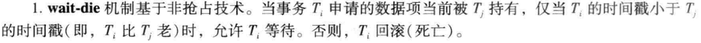
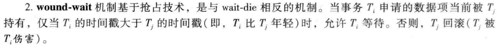

# 数据库系统概念原书第六版的笔记

## 第14章 - 事务

### 1. 事务的概念

**事务**是访问并可能更新各种数据项的一个程序执行单元。

**事务**具有以下四个特性(**ACID**)：

1. ATOMIC，原子性：要么全部执行，要么全部不执行。（为了保证原子性，需要日志，这是**恢复系统(recovery system)**的工作，持久性也需要rs来保证）
2. CONSISTENTCY，一致性：如果数据库执行事务前是一致，那么执行完后也需要保证数据库的状态是一致的（反应是真实世界的状态）
3. ISOLATION，隔离性：可能有多个事务并发执行，但在目前的事务看来，其他事务要么是在之前执行，要么是在之后执行，当前事务感受不到有其他事务在并发执行。（确保隔离性是由**并发控制系统(concurrency-control system)**来保证）
4. DURABILITY，持久性：事务成功后，对数据库的改动是永久的。

### 2. 可串行化的概念

事务并发的执行可能会出现很多问题，隔离性与原子性无法保证。如果我们强制事务串行执行就简单很多，但这样对性能会有很大的影响。

如果我们能保证任何调度的效果都和没有并发执行的调度效果一样。这样就能保证可串行化。先不讲如何实现，先介绍一下相关概念。

可串行化的概念如下：

**可串行化**（serializable）**调度**：如果我们可以保证所执行的任何调度都可以等价成一个串行执行的调度，这种调度就是可串行化调度，这需要并**发控制系统**来保证。

可串行化分为三种，重点关注是**冲突可串行化(conflict serializability)**

对于事务中的**指令**，可以分为read和write两种，对于这两种指令，只有全为read的时候，两种指令次序才无关紧要可以交换。

将一个调度S中的指令进行一系列非冲突的交换后得到S'，说明这两个调度是**冲突等价(conflict equivalent)**的。

如果判断一个调度是否冲突可串行化？

为当前的调度S构造一个有向图，这个图叫**优先图(precedence graph)**，图中的边是从一个事务指向另一个事务，指向的原因是事务中存在两个指令，这两个指令无法进行非冲突的交换，将所有可能的情况的边画成图后，如果图没有**环**，则为冲突可串行化的。

如果获取**串行化顺序**？

根据生成的优先图，进行**拓扑排序**。

### 3. 事务的隔离性与原子性

之前讨论调度是假设事务不会失败，如果事务失败了该如何恢复呢？

**可恢复调度**的概念：对于事务Ti和Tj，如果Ti读取了Tj所写的数据，那么Ti在Tj提交后提交。如果提交前提交，那么Ti写之前的数据就找不回来了，数据无法恢复。

**级联回滚(cascading rollback)**：如果一个Ti+1依赖于Ti，即读取了TI没有提交的事务，那么当T1没有提交成功的时候，被他所**依赖**的一系列事务都需要回滚。

**无级联调度**的概念：对于每个事务，如果Ti读取了Tj的数据，那么Tj必须在Ti**读之前提交**。

### 4. 事务的隔离级别

可串行化虽然非常好，但是并发度可能非常小，可以采用更弱的一致性级别来提交性能同时保证一定程度的正确性。

//TODO

1. 可串行化(Serializable)：保证可串行化调度（即任何调度的情况都可以等价成串行化的调度）（一些实现中某些情况下允许非可串行化）
2. 可重复读(RR)
3. 读已提交(RC)(很多数据库**默认**的级别)
4. 读未提交(RU)

### 5. 隔离级别的实现

1. 锁
2. 时间戳
3. 多版本和快照隔离

## 第十五章，并发控制

### 1. 锁的类型

1. shared
2. exclusive

**死锁**：如果几个事务互相等待，形成环路，就出现了死锁，这种情况就必须**回滚**其中一个事务

**封锁协议**：即规定了事务什么时候进行加锁减少，封锁协议会导致可能的调度数量减少。如果这些调度的集合是所有可能的可串行调度的一个真子集，就可以做到冲突可串行化调度。我们称一个封锁协议**保证**了冲突可串行化

**饿死**（starved）：如果一个事务申请一个锁的时候，一直无法被授权，比如申请X锁的时候，一直有S锁在使用

可以通过以下方法避免饿死，给一个锁授权的条件是:

**两阶段锁协议**(two phase locking protocol)：

这是**保证可串行性**的一个协议，将加锁和解锁分成2个阶段

1. 增长（growing phase）阶段，事务可以获得锁，但是不能释放锁
2. 缩减（shrinking phase）阶段，事务可以释放，但是不能获得新锁

**封锁点**：最后加锁的位置（增长结束的位置），把封锁点排序就是事务的一个可串行化的顺序

不保证不发生**死锁**

还是可能发生**级联回滚**

**严格两阶段封锁协议**（strict two phase locking protocol）：所有的**X锁**必须在事务提交到才释放，可以保证没有**级联回滚**

**强两阶段封锁协议**（rigorous two phase locking protocol）：**任何锁**都必须要在事务提交后才能释放。

**锁转换**（lock conversion）：为了获得更高的并发度，可以允许S锁**升级**（upgrade）为X锁。但升级只能在上升阶段，降级只能在缩减阶段。

一个简单的2PL实现想法：调用read或者write操作的时候，就产生一个lockS或者lockX的指令放在read和write前，事务提交后就释放所有的锁

锁管理器：// TODO

基于图的协议：// TODO

### 2. 死锁处理

以下两种都可能引起回滚。如果进入死锁的概率较高，通常使用死锁预防，否者使用死锁检测与恢复更适合。

1. 死锁**避免**（deadlock avoidance）从根本上避免死锁的形成
2. 死锁**预防**（deadlock prevention）保证系统永远不进入死锁状态。
3. 死锁**检测**（deadlock detection）死锁后使用死锁恢复(deadlock recovery)进行恢复

#### 死锁**预防**：

方法1：对加锁请求进行**排序**或者要求同时获得所有的锁

同时获取所有锁很难，1. 因为事务开始前很难知道哪些数据项需要加锁。2. 如果数据项的用率很低，那么会影响并发的程度。

防止死锁的一个方法就是对所有的数据项加一个次序同时规定只能按照顺序对数据进行加锁。

方法2：当有可能导致死锁的时候，进行事务**回滚**而不是等待加锁

被授予TI的锁，可能因为Ti事务回滚从而导致Ti被抢占（preempted）。

通过给每个事务授予一个**时间戳**，用Timestamp来决定等待还是回滚。

两种的特点都是让时间戳更大（更年轻的一个事务）的回滚，区别是自己回滚还是让对方回滚。

这两种的问题都是可能发生**不必要的回滚**

方法3：**锁超时**，如果一个锁等待时间太长则进行回滚。如果事务都比较短并且长时间等待确实很有可能是由死锁引起的情况下，采用这个方法很好。

但缺点在于很难确定一个事务超时前应该等待多长时间，可能会导致**浪费较长的时间**进行等待，也可能**导致不必要的回滚**。同时这个机制也可能导致**饿死**。因此应用有限。

无等待算法（No-Waiting Algorithm) 如果一个事务无法获取锁，那么立即中止，稍后重试

谨慎等待（Cautions Waiting）如果T1尝试获取X的锁，X已经被T2锁住，那么看T2有没有等待其他锁，没有如果，就运行继续等待，否者中止T1

#### 死锁**检测**：

采用**等待图**（wait for graph）的有向图来描述。边Ti->Tj代表Ti申请的数据的锁目前被Tj持有。

合适激活算法取决于：1. 死锁的发送频率？2. 多少事务会被影响？

**死锁恢复：**

1. 选择牺牲者：一般选择**最小代价**，最小代价可能与很多因素相关。
2. 回滚：分为彻底回滚（total rollback)，直接终止这个事务，部分回滚（partial rollback）,需要当前事务的额外状态信息。回滚到需要释放的锁的前面。恢复机制必须能处理部分回滚，并且能在部分回滚后恢复执行。
3. 饿死：如果是cost based选择牺牲者，那么卡呢导致一个事务总设备选择牺牲者，导致饿死，需要保证一个事务被选为牺牲者的次数有限，所以cost中需要包含回滚次数。

### 3. 多粒度的锁

增加一种名为意向锁类型的锁

### 4. 基于时间戳的协议

