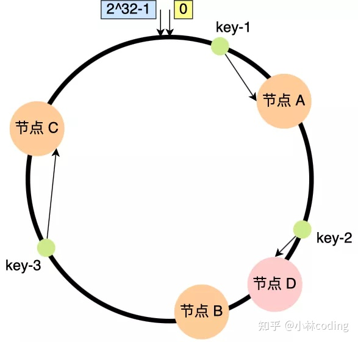
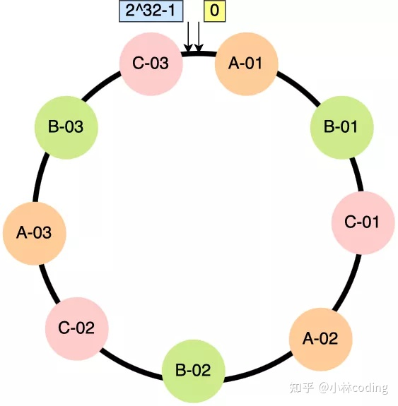

# 深入理解分布式系统

## 第一章 认识分布式系统

为什么需要分布式系统？

1. 高性能需要
2. 可扩展性，单机性能有限
3. 高可用性，保证能一直服务不出问题

分布式系统有哪些挑战？

1. 网络延迟问题（消息丢失、延迟、乱序、重复、误以为已经下线等等）
2. 部分失效，不确定系统的某个部分什么时候会失效
3. 时钟问题，谷歌用TrueTime API保证生成递增的时间错，更好的方式是用逻辑时间+状态机解决。


## 第二章 分布式系统模型

**两将军问题**，即两个军队发消息约好一起进攻，但无论发多少轮都无法保证对方确认了自己的进行计划。如果最后一位发送的信使没有回来，就代表对方可能不会一起进攻？

说明分布式系统无法确认另一个节点的状态。只有发消息来尽量得知，但这个状态可能已经过时了。

**拜占庭将军问题**

节点共识的时候，如果出现背叛的情况


## 第三章 分布式数据基础

### 1. 分区

可拓展性的实现方法之一是**分区**，包括**水平分区（分布式系统中常被称为分片（Sharding））**和**垂直分区**

OLAP这种列式数据库算是已经做过垂直分区了。

但是垂直分区不能无限细分，水平分区可以无限系统，水平分区更加常见。

**水平分区算法**：

|            | 优点                                                         | 缺点                                                         |
| ---------- | ------------------------------------------------------------ | ------------------------------------------------------------ |
| 范围分区   | 简单、关键字**可以范围查询**、局部性情况下性能好，更容易再分区 | 分区键之外范围查询性能差、跨节点性能查、容易分布不均，**局部热点**（继续分区来解决） |
| 哈希分区   | **可以避免热点问题**                                         | **无法范围查询**，再分区的时候，会有大规模的数据移动         |
| 一致性哈希 | 比普通哈希，再分区的时候数据迁移更少                         |                                                              |

普通哈希重新设计哈希函数的时候，会导致大量的数据重新映射。

**一致性哈希**：设计一个哈希环，大小从0到2^32-1。

**没有虚拟节点**(virtual node)的情况下，假设有ABC三个节点

1. 每个节点算出一个哈希环上的哈希值，找到对应的位置
2. 每个数据算出哈希值
3. 映射：每个数据的哈希值映射到顺时针找到的第一个节点。

本质上就是**节点**与**数据**都算出哈希值，在哈希环上找到对应关系

缺点：还是存在分布不均匀的情况

有**虚拟机节点**的一致性哈希

1. 将每个节点，分配一定量的虚拟节点，比如A分配A0、A1、A2三个虚拟节点
2. 将每个虚拟节点算出一个哈希值
3. 将每个数据算出一个哈希值
4. 映射：每个数据的哈希值映射到顺时针找到的第一个虚拟节点。

优缺点：分布不均匀的情况大大缓解，并且每次增减节点的时候，都是会从多个节点中转移数据，更负载均衡。

 

**分区的挑战**

**分区**主要是为了**可扩展性和性能**，**复制**可以保证**可靠性**，复制和分区最好一起使用。

复制可能提高可靠性和可用性，一个机器坏了还有其他节点。也可以**提高性能**，数据在多个服务器，请求的时候可以在最近的服务器处理。多台机器也可以提高吞吐。

### 2. 复制分类

**单主复制**

1. 同步复制（影响性能）：主节点收到请求，必须所有节点都执行完成，收到确认消息，才算写入成功
2. 异步复制（影响一致性和持久性）：主节点收到请求，会立刻返回请求成功。
3. 半同步复制：保证至少有一个节点同步成功，才返回请求成功。保证主节点挂掉，从节点能接替主节点工作。（leader切换，分为自动切换和手动切换，自动切换的情况下需要Lead选举，如果出现网络分区，也可能出现2个leader，导致数据损坏）

**多主复制**

缺点是多主都接受写请求，可以导致出现写入冲突的情况，解决方法：可以人为的用哈希将某一类请求都交给一个Leader处理。

其他解决手段：TODO

**无主复制**

亚马逊Dynamo。TODO

### 3. CAP定理

在一个异步的网络环境中，分布式读写存储，只能满足下面三项中的两项

* 一致性（Consistency）（指的是**线性一致性**）：client读取所有的节点，获得的都是最新的数据
* 可用性（Available）：client每次读取都能获得相应，但不保证获得数据是最新的
* 分区容错性（Partition Tolerance）：出现网络分区消息丢失的情况下，系统仍然能够正常运行

网络分区发送的概率很小，没有分区的情况下，一致性和可用性都可以保证。但是在有分区存在的情况下，才需要在可用性和一致性中保持一致

**PACELC定理**：是对CAP的扩展，增加了如果不存在分区的清下，需要在延迟和一致性中二选一

### 4. 一致性模型

下面四种是**以数据为中心**的一致性模型

多核CPU也存在相应的问题，现代CPU在访问内存的时间，不保证线性一致性，原因是**同步指令开销大**。也不保证顺序一致性，因为编译器和CPU可能会**重排指令**。

**线性一致性**(Linearizable consistency)：最强的一致性模型，系统中的所有组件看起来都像是原子的。

严格定义：给定一个执行历史，**执行历史**根据并发操作可以扩展为多个**顺序历史**，只要从中找到一个合法的顺序历史，那么该执行历史就是线性一致性的。

每个请求都有一个调用和相应两个事件和对应的时间戳。如果两个请求的时间范围重叠，那么他们可以以任意的顺序排列。

**顺序一致性**：比线性一致性弱，只要保证同一个客户端的请求顺序是一致的即可，不同客户端之间可以任意排列。没有全局时间限制，**只关注局部顺序**，场景：**社交网络中**

**因果一致性**：只保证因果相关的操作需要是有序的。

**最终一致性**：只要最终达到稳定状态，中间的顺序可以不同，读取操作也不用返回最新值，只要最终没有写操作的时候，读操作能够返回相同最新的结果就行。

一致性模型和**隔离级别**的区别：一致性性针对的是**单个操作对象**，而隔离级别涉及到**多个操作对象**。

线性一致性与可串行的区别：线性一致性有**实时性的保证**，串行化没有，串行化的顺序与实时的顺序可以不一样。两者同时实现叫严格串行化

## 第四章 分布式共识

见Raft协议.md

## 第五章 分布式事务

事务必须遵守ACID四个事务，但是在分布式事务中，主要是**原子性**（ATOMIC）与**隔离性**（并发）与单机的区别很大。**一致性**与**持久性**没有很大的区别。

* 一致性主要是指业务方面的约束，需要业务和数据库一起控制
* 持久性主要是让数据能存储在非易失性设备中，主要由WAL控制。总体和单机也没什么区别
* 原子性由于涉及到多个节点，一个节点故障，需要所有节点都回滚。单机的原子性主要由WAL或者日志或者磁盘的512B原子写等硬件和原价一起保证。但是分布式场景多了**网络不可靠的因素**
* 需要隔离其它的并发事务，需要锁和多版本并发控制

**原子提交协议**有三个特征，（本质上是让所有的节点达成共识，是分布式共识问题的一个子问题）

* 协定性，所有的进程都一起决议一个值，要么都提交，那么都中止
* 有效性，有一个进程决定中止，那么系统就会中止事务
* **终止性**：分为弱中止和强中止，弱中止是如果没有任何

### **2PC：两阶段提交**（阻塞提交算法）

由一个协调者（Coordinator） 和 参与者（participants）两者共同组成。

1. Prepare Phase(Vote Phase)：向所有的参与者发送准备消息，参与者会执行事务但是不提交，如果执行失败会发送回response给协调者。
2. Commit Phase：如果上一轮收到的全部都是“是”，那么这一轮协调者就会发送commit消息给参与者，让参与者提交。如果上一轮收到的里面有”否“，那么这一轮就会发送abort消息给参与者。

2个阶段中任何节点都要可能挂掉，所以每次收到事务消息都需要写入WAL来持久性事务，让宕机后也能够恢复继续执行事务。

可能出错的情况：

* 第一阶段**参与者宕机**，这种情况协调者可以设计**超时等待**，超过这段时间没有投票则中止
* 第一阶段**协调者宕机**，那么**参与者**将一直**阻塞**。直到协调者恢复，或者人工干预
* 第二阶段协调者只发了部分数据都宕机了，同时部分参与者已经commit了，这种情况下**数据会不一致**，2PC无法解决这个问题


### **3PC：三阶段提交**（非阻塞）

主要是为了解决2PC阻塞的问题，两者都引入了**超时机制**。协调者宕机，**会选举新协调者**，在第二阶段中增加了一个Pre-Commit Phase。同时第一阶段并不执行事务

1. Prepare Phase(Vote Phase)：向所有的参与者发送准备消息，参与者会**不执行事务**，只会检查条件
2. Pre-Commit Phase：如果收到的都是是，则发送pre commit消息，参与者会检查条件，满足条件就执行事务，并记录日志。
3. Commit Phase：如果上一轮收到的全部都是“是”，那么这一轮协调者就会发送commit消息给参与者，让参与者提交。如果上一轮收到的里面有”否“，那么这一轮就会发送abort消息给参与者。

3PC解决了**协调者的单点故障问题**，但是没有解决数据不一致的问题。

同时由于超时机制的原因，网络分区的情况下，3PC可能会选出2个协调者。同时三轮消息也增加了延迟。

总体来说3PC就是在执行事务前多了一次类似心跳检测的轮，可以快速结束事务

### 并发控制

* 悲观并发控制：获取任何数据之前，都悲观的认为可能会有冲突，会加锁。
* 乐观并发控制：认为冲突是小概率事件，只有在事务结束的时候才会检查是否正确。
* 多版本并发控制：用来实现快照隔离，快照隔离可以避免大多数的异常情况

#### **2PL**：TODO

2PL无法预防死锁

**死锁**：

避免：

预防：

检测：

#### 乐观并发控制

基于**检查**的并发控制（Validation-Based Concurrency Control)

* 读取：将数据复制一份修改，其他事务无法访问
* 校验（Validation）：检查期间事务是否与其他事务有冲突，有冲突就abort
* 写入：如果没有冲突，就写入

基于**时间戳**的并发控制：

每个事务有一个TS(Ti)，同时每个数据项有W-Timestamp（X），还有R-Timestamp(X)，表示最近的一次被读取写入的时间。

事务读取的时候对比TS和W和R，判断当前操作是否合法。

#### 多版本并发控制

1. 多版本2PL（MV2PL）
2. 多版本乐观并发控制（MVOCC）
3. 多版本时间戳排序（MVTO）

#### Percolator协议

基于BigTable的单行事务来实现**多行事务**，还有一个单点授时、单事件源的授时服务。

Percolator协议实现了**多版本时间戳排序**的并发控制，使用**2PC**来提交，还有无等待的死锁预防策略。

提供了跨行、跨表的、基于快照隔离的ACID事务。

Bigtable只支持单行级别的事务，不支持多行级别的事务，Percolator协议就是解决这个问题。

协议相比data列，还额外增加了**lock和write列**

```c++
//Lock列
(key,start_ts) ==> (primary_key,lock_type)
//Write列
(key,commit_ts) ==> (start_ts)
//Data列
(key,start_ts) ==> (value)
```

**snapshot isolation**：

读：能够从一个时间戳中稳定获取快照

写：并发的写-写冲突同时更新一个记录，只有一个能提交成功。

预写(**PreWrite**)过程：

1. 分配一个start_ts时间戳
2. 客户端会从所有key中选出一个作为 Primary ，其余的作为 Secondaries 。并将所有的key/value数据写入请求并行地发往对应的存储节点。存储节点对key的处理如下：

1. 开启一个BigTable单行事务

2. 读取写操作涉及列的write信息，如果有[start_ts, ]范围内的信息，则终止（写-写冲突检查）

3. 检查lock列[0, ]是否被其他事务持有，如果有则终止

4. 写入data列{start_ts,  value}

5. 写入lock列{start_ts, **primary**}

**Commit**过程：

1. 获取commit_ts时间戳
2. 向Primary key所在的节点发送commit请求，成功后向其他节点发送commit请求，节点处理过程：

1. 读取lock[start_ts]，判断是否持有锁

2. 写入write列{start_ts, commit_ts}（**只有写入Write后，才能够读到**）
3. 删除lock

**Read**过程：

1. 读取lock列[0, start_ts]内是否有锁，有则需要停止（等待一段时间，还没有unlock就回滚）
2. 读取write列{key, start_Ts}获取最新版本。
3. 读取data列，根据最新版本的start_ts获取数据。

**回滚**操作：

Rollback 取决于 primary key 的状态，primary key 就是那个 commit 和 rollback 的分水岭。存在如下三种可能：

1. Primary key 的 Lock 还在，代表之前的事务没有 commit，就选择回滚。
2. Primary key 上面的 Lock 已经不存在，且有了 Write，那么代表 primary key 已经被 commit 了，这里我们选择继续推进 commit。
3. Primary key 既没有 Lock 也没有 Write，那么说明之前连 Prewrite 阶段都还没开始，客户端重试即可。

状态：

|                | Lock | write |
| -------------- | ---- | ----- |
| PreWrite       | 有   | 无    |
| commit执行中   | 有   | 有    |
| commit执行结束 | 无   | 有    |

清理锁：

采用Lazy的方式，事务执行的时候如果发现其他事务的锁未处理，事务将决定其他事务是否失败，以及清理其他事务的锁。主要是根据primary key的状态来判断要不要回滚，primary key是最先执行commit的

